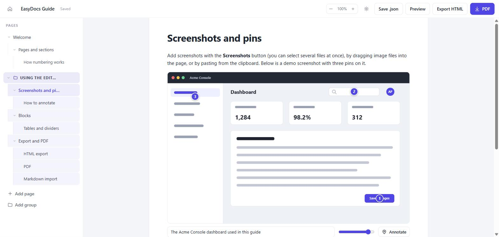
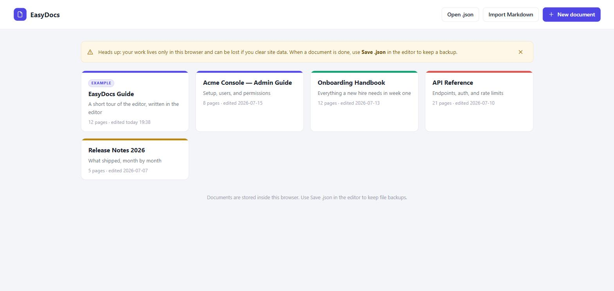
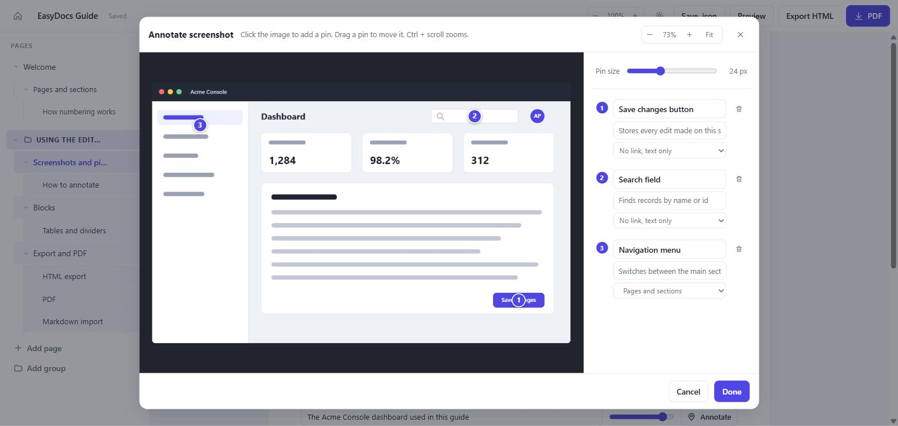
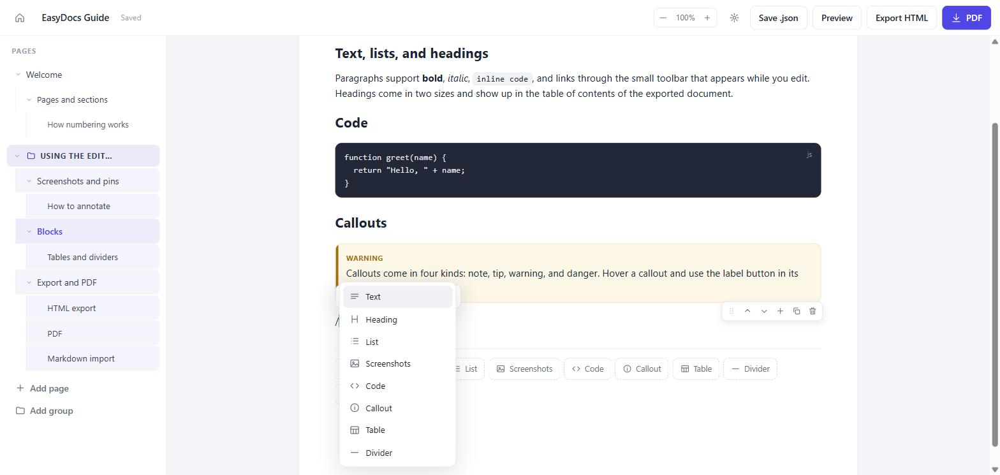

# EasyDocs

A lightweight documentation editor. Write docs, annotate screenshots with numbered pins, export to a single HTML file or a real PDF. Runs fully in your browser. No install, no server, no accounts.

<!-- Repo-stats badges: replace `cdneeee/easydocs` with your own owner/repo.
     They stay grey until the repository is pushed and public on GitHub. -->
[](https://github.com/cdneeee/easydocs/stargazers)
[](https://github.com/cdneeee/easydocs/network/members)
[](https://github.com/cdneeee/easydocs/watchers)


> **Live demo:** add your GitHub Pages URL here after deploying.

Works offline. Can also run locally in any modern browser.



## Features

|   | Feature | What it does |
|---|---------|--------------|
| ✍️ | **Block editor** | Text, headings, lists, code, callouts, tables, images, dividers |
| ⚡ | **Fast input** | `/` block menu, Markdown shortcuts, smart Enter, drag to reorder |
| 📌 | **Screenshot pins** | Drop numbered pins on images, name them, link them to pages |
| 🔗 | **Pin references** | Inline chips in text that stay in sync and turn into jump links |
| 🗂️ | **Structure** | Pages, sections, subsections, groups. Drag anything to reorder |
| 📄 | **HTML export** | One self-contained file with sidebar nav and live search |
| 🖨️ | **PDF export** | Cover page, contents with page numbers, pins drawn on figures |
| 📥 | **Markdown import** | Turn Markdown into pages, or append it to a page |
| 💾 | **Local and private** | Autosaves to your browser. `.json` backup. Nothing leaves your device |

## Composing shortcuts

Each fires on an empty line, so it never blocks normal typing.

| Type this | You get |
|-----------|---------|
| `/` | block menu, filtered as you type (`/co` &rarr; Code) |
| `# ` / `## ` | heading (H2 / H3) |
| `- ` or `* ` | bullet list |
| `1. ` | numbered list |
| `> ` | callout |
| <code>&#96;&#96;&#96;</code> | code block |
| `---` | divider |
| `Enter` | split the paragraph into a new block |
| `Enter` on an empty list item | leave the list |

Drag the grip in a block's hover controls to move it; use the arrows for single steps.

## Screenshots

| Home | Annotator |
|------|-----------|
|  |  |



## Storage and backup

Documents save to your browser (IndexedDB), private to that browser. A built-in example guide is always pinned and cannot be deleted; add your own docs alongside it.

Clearing site data wipes everything, so use **Save .json** for file backups and **Open .json** to bring them back.

## Export to PDF

1. **PDF** button: bundled pdfmake engine, contents with page numbers.
2. Open the exported HTML and press **Ctrl+P**, then pick "Save as PDF".

## Host it yourself

Static site, no build, no backend. Any static host works, and data stays in each visitor's browser.

**GitHub Pages:**

1. Push this repo to GitHub.
2. Open **Settings › Pages**.
3. Source: **Deploy from a branch**, pick `main` and `/ (root)`.
4. Open the URL it gives you.

Paths are relative, so a project subpath works. `.nojekyll` serves files as-is. Cloudflare Pages, Netlify, and Vercel work the same way with no build command.

## Files

```
index.html      the app
css/app.css     editor styles
js/state.js     data model, IndexedDB, autosave
js/home.js      document manager
js/blocks.js    block editing, image import and downscaling
js/compose.js   slash menu, Markdown autoformat, smart Enter, block drag
js/annotate.js  screenshot pin editor
js/refs.js      text toolbar and reference picker
js/export.js    standalone HTML builder
js/pdf.js       pdfmake document builder
js/markdown.js  Markdown to blocks converter
js/sample.js    the built-in guide document
js/app.js       app shell and wiring
vendor/         pdfmake.min.js and vfs_fonts.js (pdfmake 0.2.23, MIT)
docs/           screenshots used in this README
```

## License

MIT, see [LICENSE](LICENSE). Bundles pdfmake (MIT) and Roboto (Apache-2.0); notices in [vendor/LICENSES.md](vendor/LICENSES.md).
